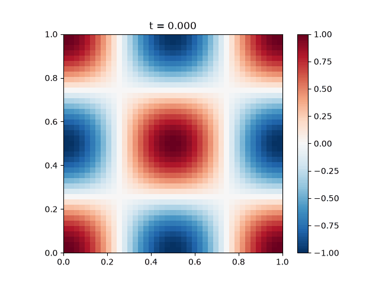

## Report for mandatory1 MATMEK-4270

### Solution 1.2.3
$$u(t, x, y) = \exp{i (k_x x + k_y y - \omega t)}$$
Subbing into Wave eq. gives
$$\frac{\partial^2u}{\partial x^2} = \frac{\partial^2u}{\partial y^2}
= - k_j^2 u,$$
$$ \frac{\partial^2u}{\partial t^2} = -\omega^2u.$$
Where $j$ is $x$ and $y$ respectivly. Putting it together it becomes
$$k_x^2+k_y^2 = \omega^2$$
Then $u$ is a solution when the relation above is true.
### 1.2.4
From
$$u^n_{ij} = \exp{i(kh(i+j)-\tilde{\omega}n\Delta t)}$$
Subbing into discrete wave eq. gives big stuff, I define the following
$$u_{ij}^{n\pm1} = u_{ij}^n\exp{\mp i\tilde{\omega} \Delta t}, \quad u^n_{i\pm1, j} = u^n_{i, j\pm1}= u_{ij}^n\exp{\pm ikh}.$$
Now subbing in gives
$$\frac{u^n_{i, j}}{\Delta t^2}(e^{-i\tilde{\omega}\Delta t} + e^{i\tilde{\omega}\Delta t} -2 ) =\frac{2c^2u^n_{i, j}}{h^2}(e^{ikh}+ e^{-ikh}-2),$$
$$2\cos{(\tilde{\omega}\Delta t)-2} = \frac{2c^2 \Delta t^2}{h^2}(2\cos{(kh)-2}),$$
$$\sin^2(\tilde{\omega}\Delta t/2) = \frac{2c^2 \Delta t^2}{h^2} sin^2(kh/2).$$
With $C = c \Delta t/h$
$$\sin^2(\tilde{\omega}\Delta t/2) = 2C^2sin^2(kh/2)$$
To force angle equality I force $2C^2 = 1 \implies C = 1/\sqrt2 \implies \tilde{\omega} = \frac{kh}{\Delta t} = \sqrt2 ck.$ For $k_x + k_y = k$ the analytical $\omega$ is $\omega = \sqrt2 ck= \tilde{\omega}.$ 

### 1.2.5
With $m_x=m_y = 2$ and $C = 1/ \sqrt2$ both Dirichlet and Neumann has less than $10^{-12}$ l2-errors. 

### 1.2.6
  Neumann standing wave with $m_x = m_y = 2$ and $C = 1/\sqrt2$:

  

